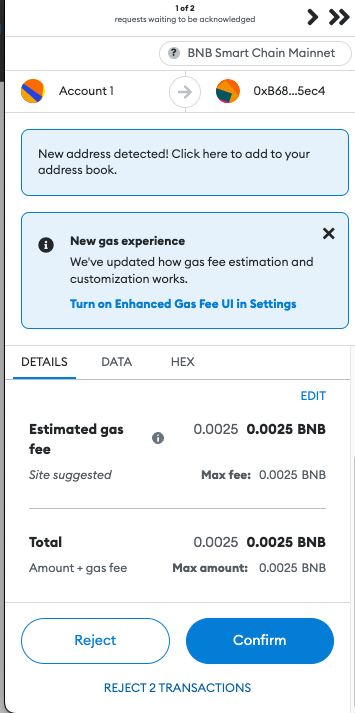

# Borrow lisUSD


**TIP**

The minimum amount to borrow is 15 lisUSD.

We suggest keeping the borrowing under the threshold shown when borrowing to reduce liquidation risks.


To borrow lisUSD:

1. On the borrow page, click **Borrow** under **My Borrowed Funds**.

<figure><figcaption></figcaption></figure>

1. On the next page, enter the desired amount of lisUSD and click **Proceed**.

<figure><figcaption></figcaption></figure>

1.  Confirm the transaction in MetaMask.

    <figure><figcaption></figcaption></figure>
2. Once the transaction completes, click **Okay** to add the borrowed lisUSD to MetaMask by clicking **Add lisUSD to MetaMask** or simply go back to the borrow page and see your borrowed lisUSD.

<figure><figcaption></figcaption></figure>

