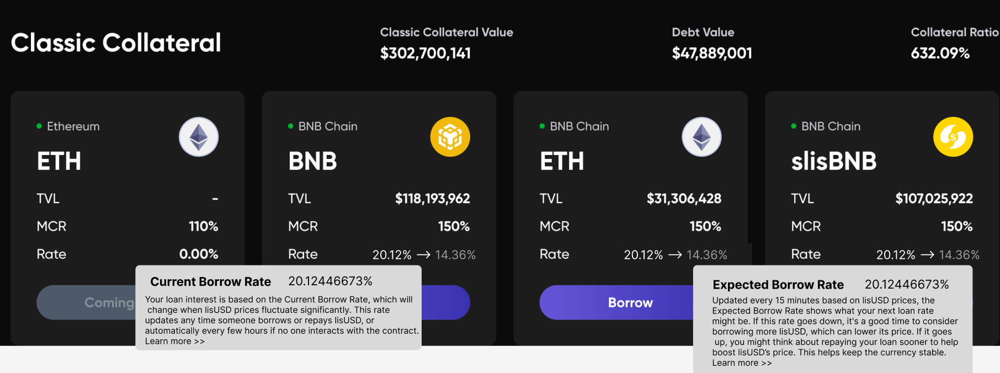

# LISTA

## How to Lock LISTA tokens

1. Head over to website [here](https://lista.org/), and connect your wallet to Lista DAO’s DApp.

<figure><figcaption></figcaption></figure>

2. At the top of the webpage, click on “Lock & DAO”

<figure><figcaption></figcaption></figure>

3.  Enter the amount of LISTA tokens you would like to lock into veLISTA.\
    Note\* LISTA conversion rate is as follows:

    1 LISTA (Lock 52 weeks) = 52 veLISTA\
    1 LISTA (Lock 20 weeks) = 20 veLISTA\
    1 LISTA (Lock 1 Week) = 1 veLISTA

<figure><figcaption></figcaption></figure>

4. The Auto Lock function is turned on by default. This means that if users do not turn this function off, LISTA will perpetually and automatically be relocked every week.\
   \
   If the function is turned off, the user’s veLISTA will decrease every week (on every Wednesday UTC+0), until week 0, where the locked LISTA will be unlocked, and users can claim their LISTA tokens anytime.&#x20;

<figure><figcaption></figcaption></figure>

5. Click on “approve”, and sign the transaction

<figure><figcaption></figcaption></figure>

6. Once the “approve” transaction is completed, click on “Lock” , and sign the transaction.

<figure><figcaption></figcaption></figure>

7. Once the “lock” transaction is completed, you are done!\
   You can check your veLISTA holdings under “Your Lock” in the same page.

<figure><figcaption></figcaption></figure>

## How to extend your LISTA lock

Users can choose to extend their LISTA locks at any point in time.

Here is how you can do it:

1. To extend your lock on your LISTA tokens, head over to the Lista DAO’s locking page [here](https://lista.org/lock), and connect your wallet to Lista DAO’s DApp.

<figure><figcaption></figcaption></figure>

2. On the right hand side, click on “extend” , and drag the extension button to the number of weeks that user would like to extend their lock for.

<figure><figcaption></figcaption></figure>

3. Click on the “Extend” button, and sign the transaction.

<figure><figcaption></figcaption></figure>

4. Once the “Extension” transaction is completed, you are done! Your new unlocking date will appear on your Lock dashboard.

<figure><figcaption></figcaption></figure>

## How to turn on “Auto lock” at anytime

Users can choose to turn on the “Auto lock” function anytime they want to avoid the hassle of manually relocking their LISTA tokens every week. Users can also choose the number of weeks that they would like to auto lock their LISTA at.&#x20;

Here is how you can do it:

1. Head over to Lista DAO’s locking page [here](https://lista.org/lock), and connect your wallet to Lista DAO’s DApp.

<figure><figcaption></figcaption></figure>

2. Simply turn on the “Auto lock” function on the top right hand corner by clicking on it.&#x20;

<figure><figcaption></figcaption></figure>

3. Users can choose to auto lock their LISTA tokens for any amount of time in perpetuity, between 1 to 52 weeks. In this example, we are choosing to auto lock LISTA tokens perpetually at 20 weeks. Once you have confirmed the autolock period, turn on the Auto lock function in step 2, and a pop-up will appear. Click on “confirm”, and sign the transaction.&#x20;

<figure><figcaption></figcaption></figure>

4. Once the “Enable Auto lock” transaction is completed, you are done!

## How to unlock your LISTA from veLISTA

Users can unlock their LISTA token anytime they want by paying an Early Unlock Fee. If they want to avoid paying the Early Unlock Fee, they will have to wait until the lock period ends.&#x20;

Do note that if users want to avoid paying any early Unlock fees, they will have to turn off the auto lock function, and wait for their LISTA tokens to be fully unlocked.&#x20;

Here’s how you can do it:

1. Head over to Lista DAO’s locking page [here](https://lista.org/lock), and connect your wallet to Lista DAO’s DApp.

<figure><figcaption></figcaption></figure>

2. On the top right hand corner under the “Your Lock” section, click on “Claim”.

<figure><figcaption></figcaption></figure>

3. A pop-up will appear, showing you the exact amount of Early Unlock Fees that you need to pay in order to unlock your locked LISTA tokens. If you have completed the locking period before claiming your tokens, the early Unlock fee will be 0, and you do not have to pay any additional fees. Once you have confirmed the Early Unlock Fee amount, click on “unlock”, and sign the transaction.

<figure><figcaption></figcaption></figure>

4. Once the transaction is completed, you will receive your LISTA tokens (minus the Early Unlock Fee if any), and you are done!

<figure><figcaption></figcaption></figure>

## How to claim your veLISTA rewards

Users will also be eligible to receive share protocol incentive rewards when they lock their veLISTA. \
\
Users will earn rewards in the following tokens:\
1\. slisBNB\
2\. wBETH \
3\. lisUSD \
4\. LISTA&#x20;

Here is how they can do it:

1. Head over to the rewards section on Lista DAO [here](https://lista.org/rewards):

<figure><figcaption></figcaption></figure>

2. Under the “veLISTA Incentive”, click on “Claim”, sign the transaction, and you are done!

<figure><figcaption></figcaption></figure>

\
\
