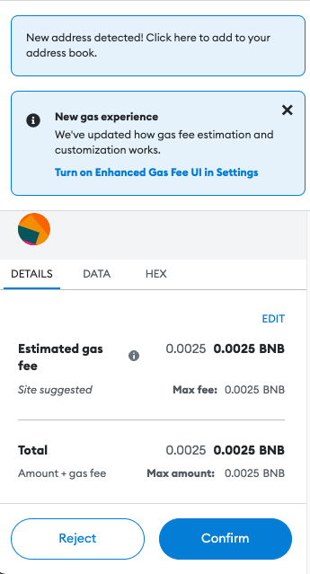

---
layout:
  title:
    visible: true
  description:
    visible: true
  tableOfContents:
    visible: true
  outline:
    visible: true
  pagination:
    visible: true
---

# Provide collateral

### 1. Connect your wallet[​](https://helio.money/docs/get-started/provide-bnb#1-connect-your-wallet) 


**NOTE**

We are using MetaMask as the example wallet due to its wide adoption in the crypto community.


1. Visit the borrow and click **Connect wallet**.
2. Choose MetaMask from the list of wallets.
3. Connect with your wallet and switch to **BNB Smart Chain (Mainnet)** by clicking **Switch network** and approving the action in MetaMask.

### 2. Provide collateral[​](https://helio.money/docs/get-started/provide-bnb#2-provide-bnb-collateral) 


The minimum deposit transaction is 0.1 for BNB deposits.

The maximum total borrow limit for lisUSD is currently set at 69,000,000 lisUSD tokens.


1. On the borrow, click the **+** button under **My Collateral** to deposit BNB. You can also choose to deposit a different collateral by clicking on the drop down button on the right side of **My Collateral.**&#x20;

<figure><figcaption></figcaption></figure>

1. On the next page, enter the desired amount of the selected asset and click **Proceed**.

<figure><figcaption></figcaption></figure>

1.  Confirm the transaction in MetaMask.

    <figure><figcaption></figcaption></figure>
2. Once the transaction completes, you are done.

