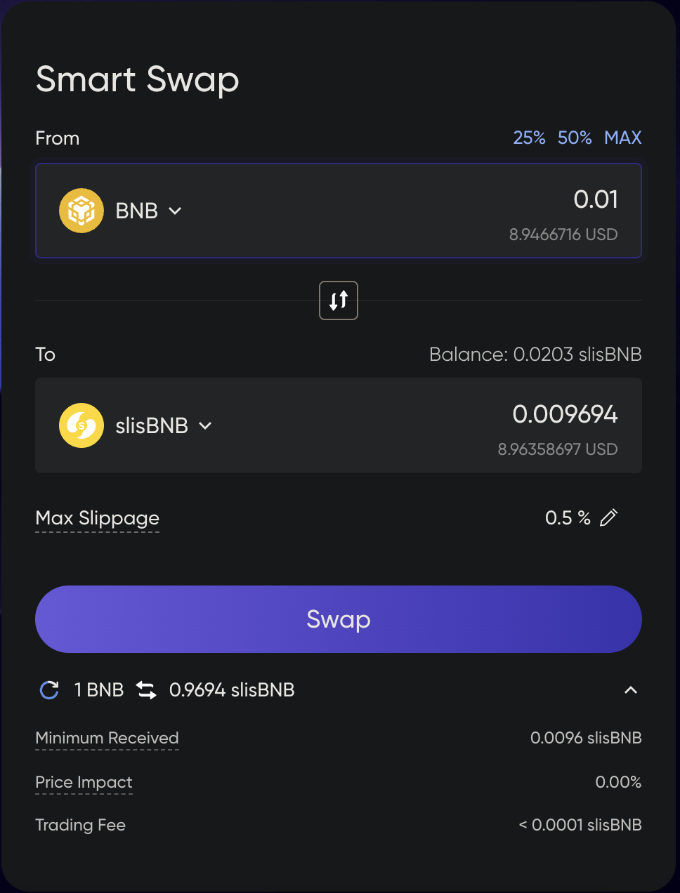

# 智能借贷与交换

## 智能借贷

智能借贷是Lista的下一代借贷解决方案，其中抵押品存入Lista的去中心化交易所（DEX）的流动性池。这为之前处于休眠状态的抵押资产开辟了全新的收入来源——交易费。

传统上，DEX常常面临如暂时性损失等风险。智能借贷通过限制不平衡抵押比率的提款来解决这一问题，维持池子的稳定性。

### 工作原理

#### 存款与借款

就像在Lista借贷的任何其他市场一样，在借款之前需要抵押品。通过智能借贷存入的抵押资产将被发送到Lista上的流动性池（LP）。

与大多数流动性池一样，这里有两种资产，交易者可以在一定的价格和交易费用下将任一资产换成另一种。资产的价格以它们的体积比表示。如果两种资产的价格保持不变，它们之间的比率也将固定。为了避免意外的价格影响，存入抵押资产时，必须保持相同的比率。

如果资产以固定比率模式存入，Lista将根据池中的体积比计算两种资产的确切数量并启动存款。然而，在自定义比率模式下，Lista将交换多余的资产以平衡它们到相同的体积比，然后将它们发送到池中。

当抵押品成功存入后，用户可以开始以一定的利率从金库中借用资产。

#### 还款与提款

部分或全部还款贷款后，将可以提取一定数量的抵押品。

抵押品提款的工作方式与存款类似。在固定比率模式下，提取的资产量将与池中的比率相同。在自定义比率模式下，Lista将交换一种资产成另一种，以确保资产具有自定义比率。

当开启“专业模式”时，流动性头寸可以作为独立的代币提取。例如，你可以提取你的slisBNB&BNB / BNB流动性头寸，并将其存入slisBNB&BNB / USD1市场，因为抵押资产相同：你的slisBNB&BNB流动性头寸。

有时，流动性头寸可能无法完全提取（池中留下< $0.01）。当这种情况发生时，请切换到固定比率，你将完整地收到你的资产。

#### 清算

就像Lista借贷的其他产品一样，智能借贷贷款面临清算的风险。每当贷款价值比（LTV）超过某个阈值时，Lista将接管头寸并开始清算过程。相应数量的抵押品将从池中提取并换成其他资产以覆盖贷款。

请参阅我们的[清算文档](https://docs.bsc.lista.org/introduction/lista-lending/liquidation)和[此文章](https://blog.lista.org/everything-you-need-to-know-about-liquidation-on-lista-smart-lending)了解更多详情。

## 智能交换

智能交换是Lista DEX的专用前端。这个DEX向Lista用户开放，用于交换资产，通过智能借贷提供流动性，也可作为Binance Swap的一条路线。

智能交换的工作方式与大多数其他DEX相同：

<figure><figcaption></figcaption></figure>

在这里，你可以选择你希望交换和接收的资产，滑点容忍度，最少接收资产，价格影响，以及交易费用，这些都将归智能借贷流动性提供者所有。