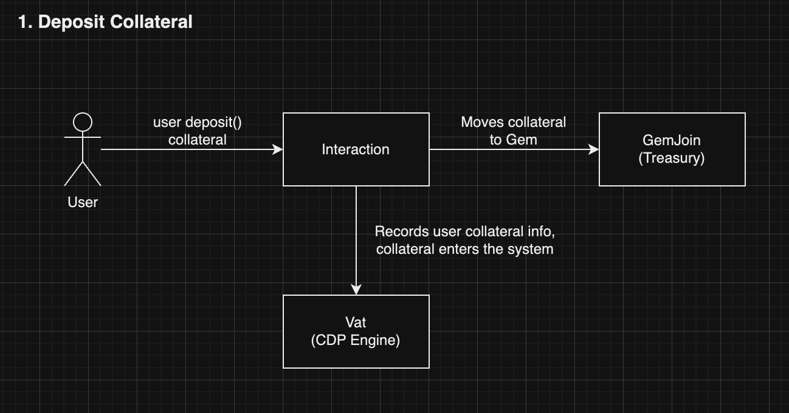

# Current vs Expected Borrow Rates

<figure><figcaption></figcaption></figure>

## Current Borrow Rates

The current borrow rate is the borrow rate that users will pay their loan on. The current borrow rate will fluctuate and update any time someone borrows or repays lisUSD.&#x20;

If nobody interacts with the repayment / borrowing contracts for lisUSD, the current borrow rate will refresh and update once every few hours.&#x20;

### Specifications:

1. Current borrow rates will be rounded to 8 decimal places.
2. Current borrow rates will be updated every 5 minutes.
3. Current borrow rate will change based on the price of lisUSD, and borrow rates that users **pay** will be based on the current borrow rate, **not** the expected borrow rate.
4. When users borrow or repay lisUSD, demand and supply of lisUSD changes, and thus, price of lisUSD changes, which in turn, changes the current borrow rates. However, the current borrowing rates will change only if lisUSD's change in price is more than $0.002. In other words, if the change in lisUSD's price is equal or less than $0.002, current borrow rates will not change.

## Expected Borrow Rate

The expected borrowing rate for lisUSD is updated every 15 minutes based on lisUSD prices. The Expected Borrow Rate shows what your next loan rate **might** be, and it doest not mean it will become the borrow rate.&#x20;

If this expected borrow rate goes down, users may consider borrowing more lisUSD, which can lower its price. If it goes up, users may consider repaying their loan sooner to help boost lisUSD’s price.&#x20;

The idea of having an expected borrowing rate is to indirect affect the demand and supply of lisUSD, helping to manage lisUSD's price expectations. This helps to keep lisUSD stable at $1.

### Specifications:

1. Expected borrow rates will be rounded to 8 decimal places.&#x20;
2. Expected borrow rates will be updated every 15 minutes.
3. Expected borrow rates simply estimates what the future borrowing rates may be, relative to the price of lisUSD. It does not guarantee that the expected borrow rates will become the future current borrowing rates.&#x20;

