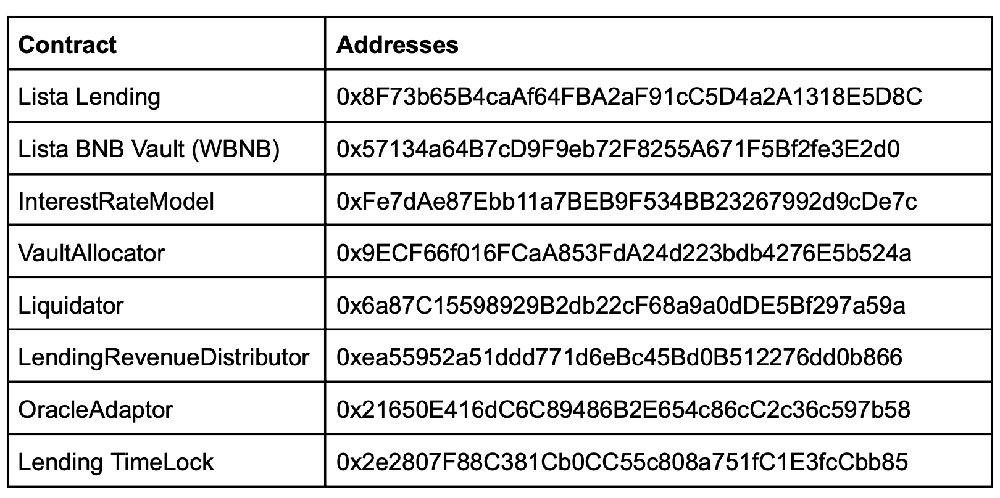

# 稳定池 (PSM) - USDT 稳定收益

1. 请访问“赚取”部分下的 USDT 稳定收益页面 [这里](https://lista.org/earn/deposit/USDT?utm_source=gitbook&utm_medium=article&utm_campaign=stable-pool-psm-usdt-stable-earn)。

<figure><figcaption></figcaption></figure>

2. 输入您要存入的 USDT 数量，然后点击“转换并质押”。

<figure><figcaption></figcaption></figure>