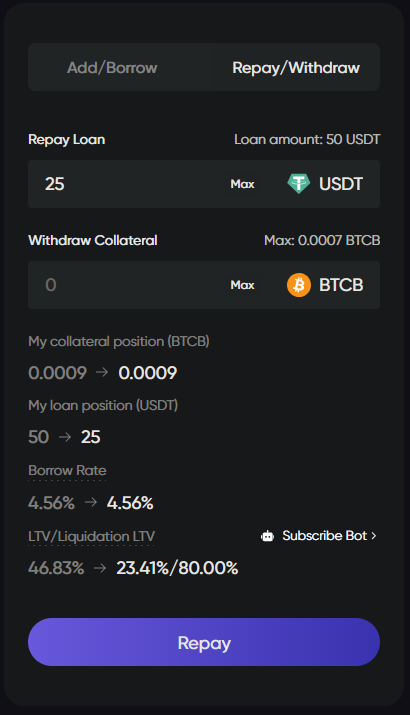

# 借贷与还款

## 在Lista Lending上借贷与还款



## 借款

1. 连接您的钱包，然后前往我们的Lista Lending页面的借款部分[这里](https://lista.org/lending?tab=borrow)。

<figure><figcaption></figcaption></figure>

2. 选择经典区域，并选择您想要借款的市场。为了简单起见，我们选择slisBNB/USD1市场。点击所选市场。

<figure><figcaption></figcaption></figure>

3. 提供slisBNB作为抵押品，并通过在相应的文本框中输入金额，点击“供应与借款”。

<figure><figcaption></figcaption></figure>

## 还款

1. 点击我的仪表板以查看您所有的借款位置[这里](https://lista.org/dashboard)。

<figure><figcaption></figcaption></figure>

2. 在“已借款”部分点击您想要还款的市场旁的“还款”。

<figure><figcaption></figcaption></figure>

3. 输入要还款的金额，并确认交易。

<figure><figcaption></figcaption></figure>